# DIY_mobile_moniter

## What is that?

The DIY monitor is a LCD-monitor, which gets build out of an old Laptop screen, an motherboard (can be bought via Aliexpress), a controll panel, an powersupply for the backlight of the monitor and an enclosure for your new monitor. This is an guide, which explains how to build such a monitor, on what you should be careful and an example.

## Step 1: Buying the parts

It is important that your electronics are compatible, to ensure this, take your Laptop and disconnect the integrated monitor, make sure to keep the enclosure of the monitor, scince it will reduce the waste and the amount of filament which you will need. After you disconnected your monitor, turn it around so that you can see the product infos. In the example below it is "LP154WX4(TL)(E1)".

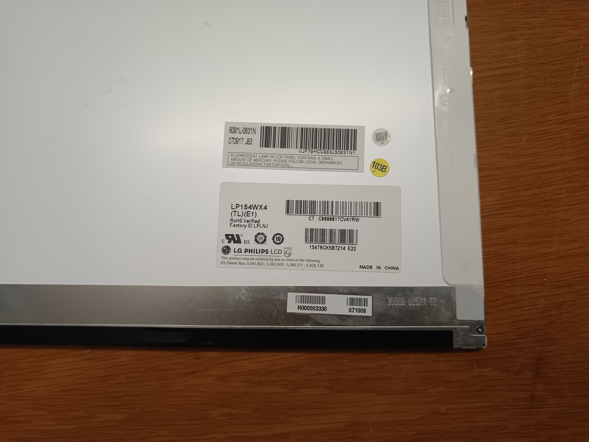

Go to your favorite website for buying electronics (I chose for aliexpress), then type your product information and add before you search "controller", make sure the parts you are buying include 1. connection for the backlide of your monitor (every LCD monitor funtions the same, you have to layers: 1. the Light scource and 2. a layer of crystals, which colors the pixels in the monitor); 2. a connection for the Layer of crystals; 3. some arrangement of bottons to change settings; 4. a power-source, which is compatible with the device. Here some pictures of my parts, which I bought:

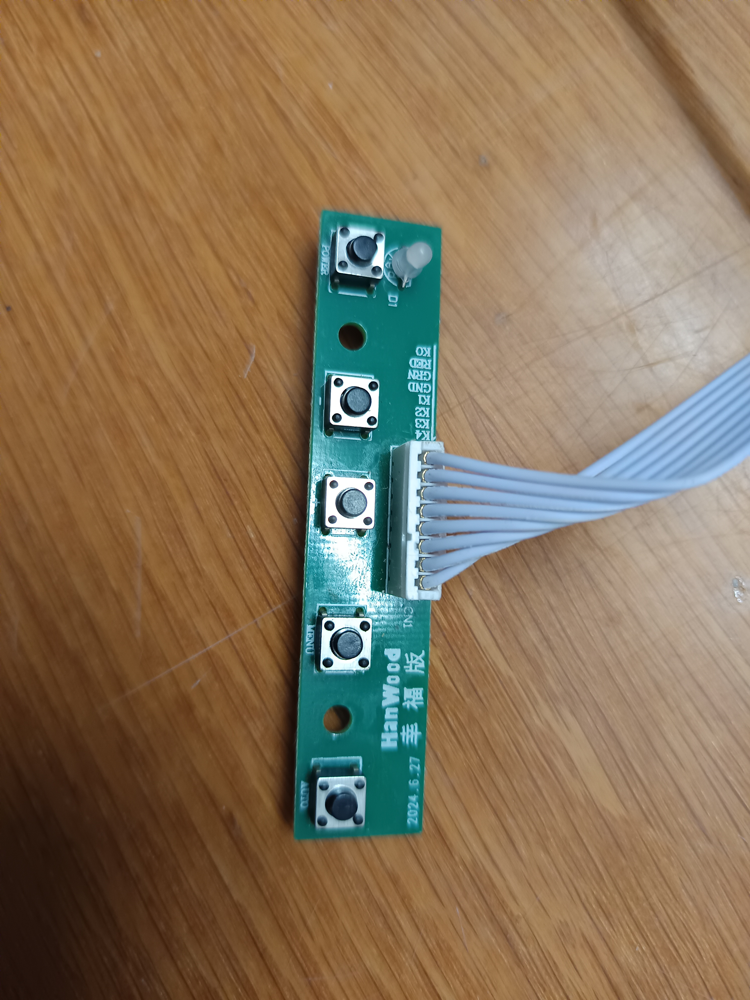
Bottons to controll the display

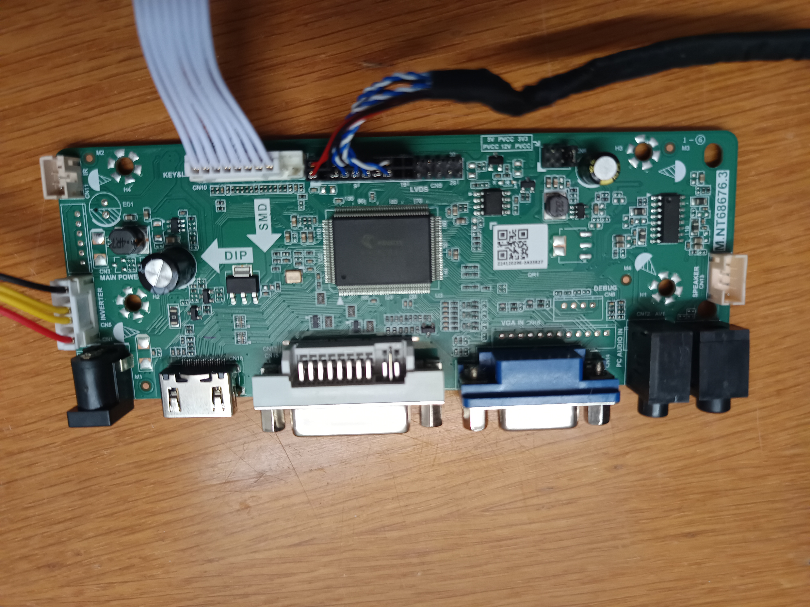
Mainboard, which has all the connectors

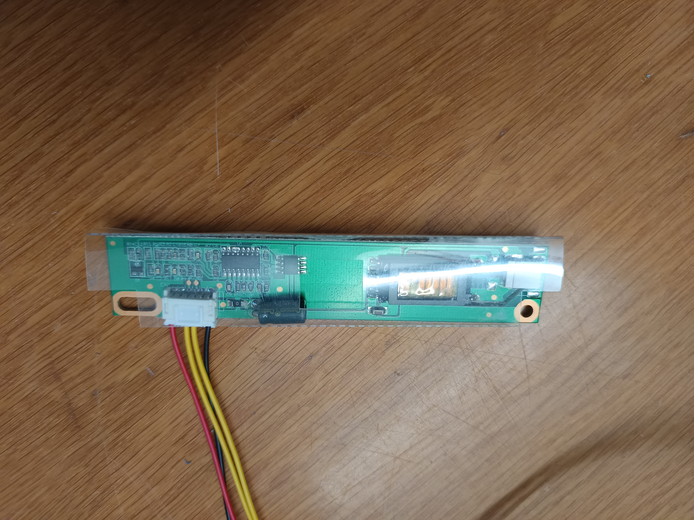
Picture of the power converter, which provides power for the backlight

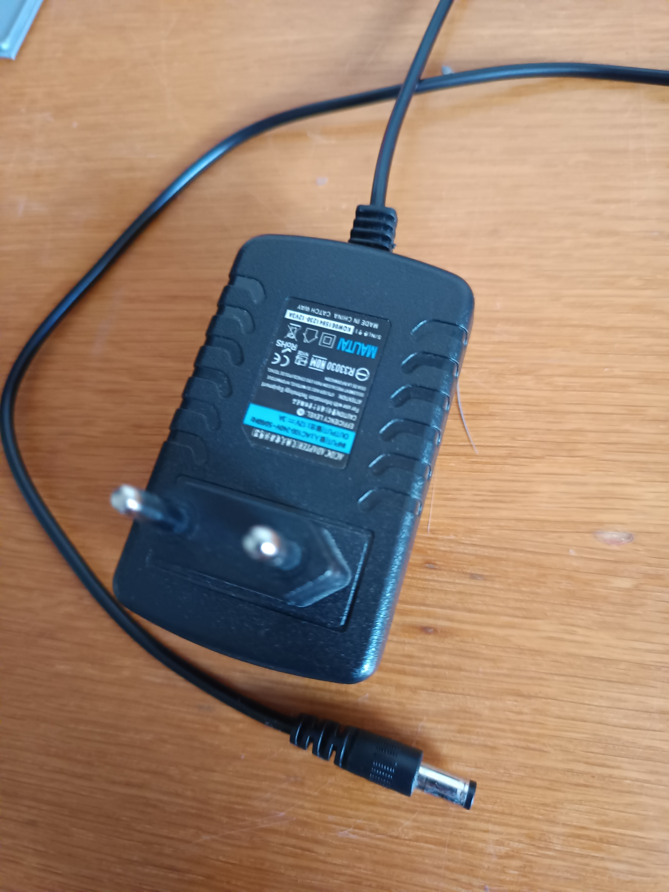
A a power supply

## Step 2: Building the monitor

When your parts arrive, you can open again your enclosure and connect your motherboard, the powersupply and the control pannel. Then close the enclosure of your monitor if possible and plug your monitor in. Test the monitor, then unplug the monitor again.

Here are some pictures, which might help you:

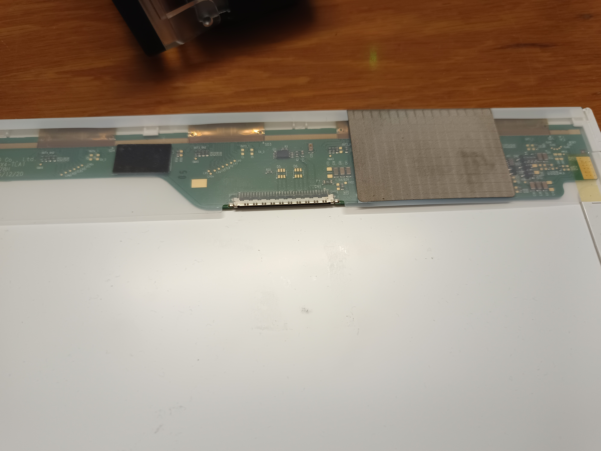
Place where to connect your mainboard to the crystals.

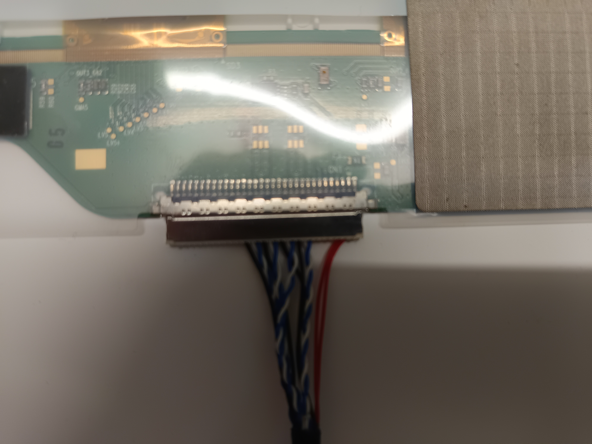
The Cable plugged in.

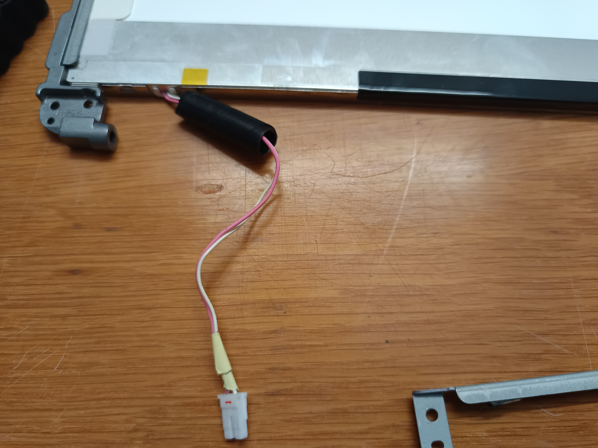
Cable for the backlight of your monitor.

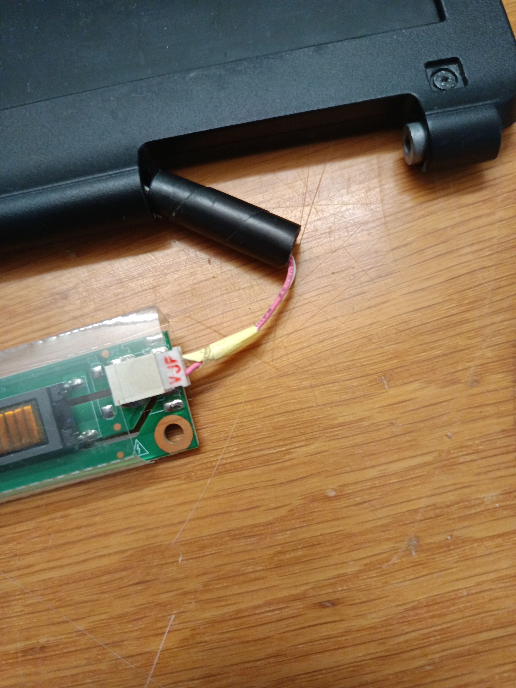
Backlight connected with the pcb which gives the backlight enough energy.

Here are some tips for what you should watch out during your monitor building:

1. No electricity on the components, when you are working on them / don't get electricuted !!!
2. If something broke or you can't connect something permanently (besase it slips out again), tape it down, but make sure everything stays strong enough for our use-case.

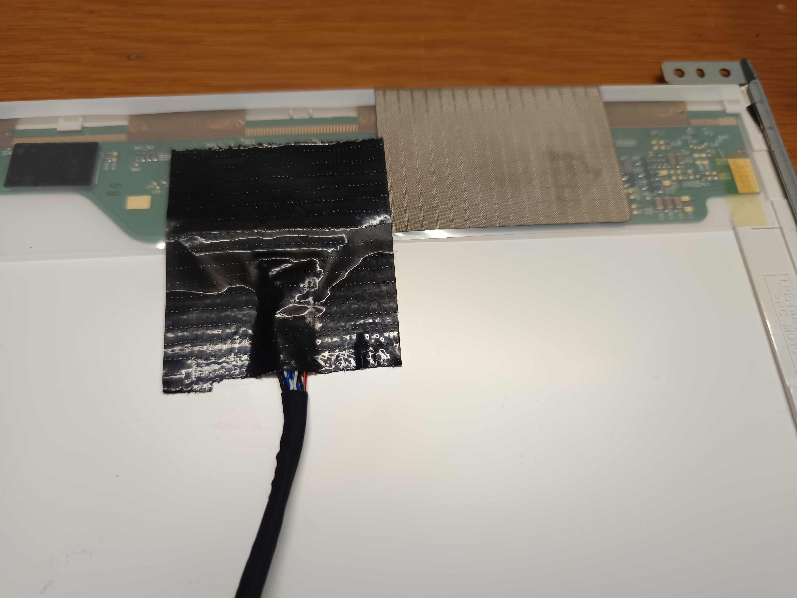

## Step 3: Enclosure for the electronics

You still need an enclosure for the motherboard, powersupply and the controll panel. So get the dimensons of your platines and adjust the provided 3D-files in your favorite editor. Then Print your case, glue the powersupply and the mainboard to the back of the Monitor case. See as reference for the following picture:

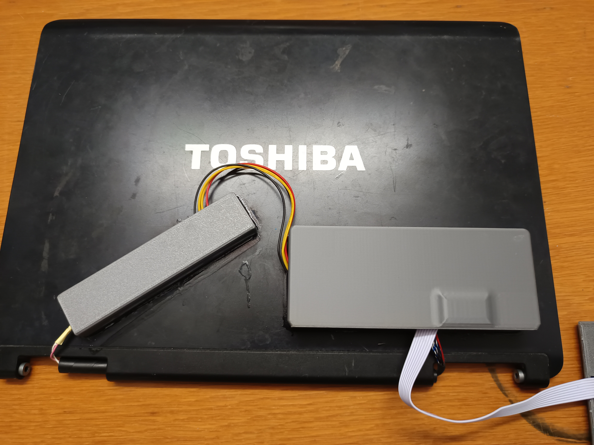

Place the controller-ocb (bottons) in his enclosure and glue it together like this:

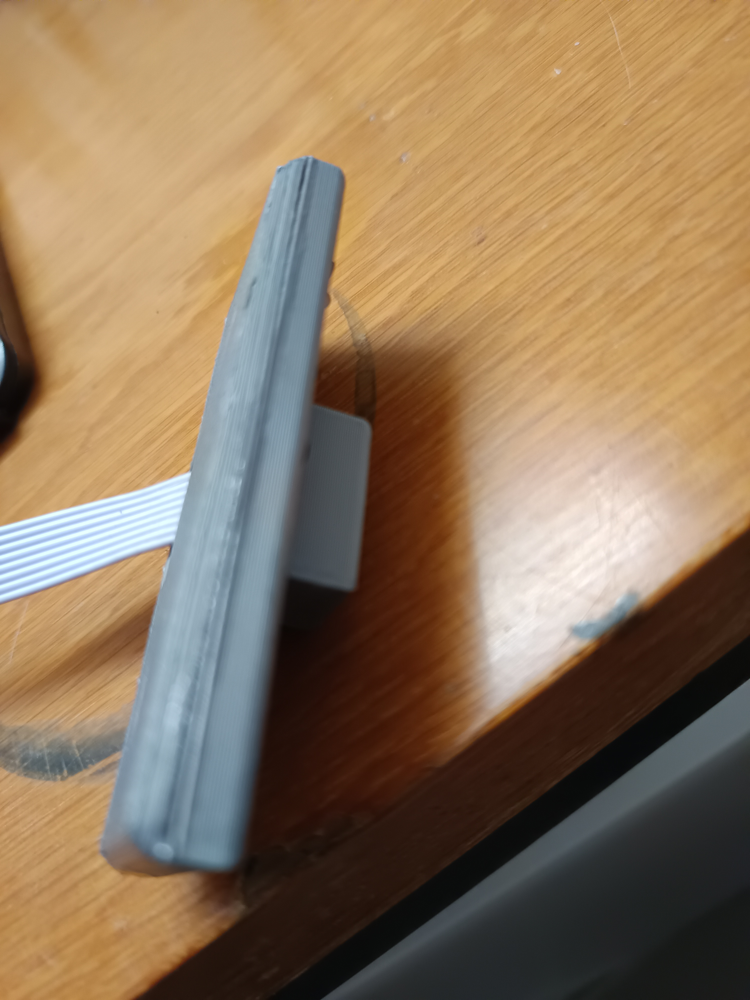

The last part, which you need to glue together is the controller-case to the side of your monitor or whereever you prefer your monitor controlls:

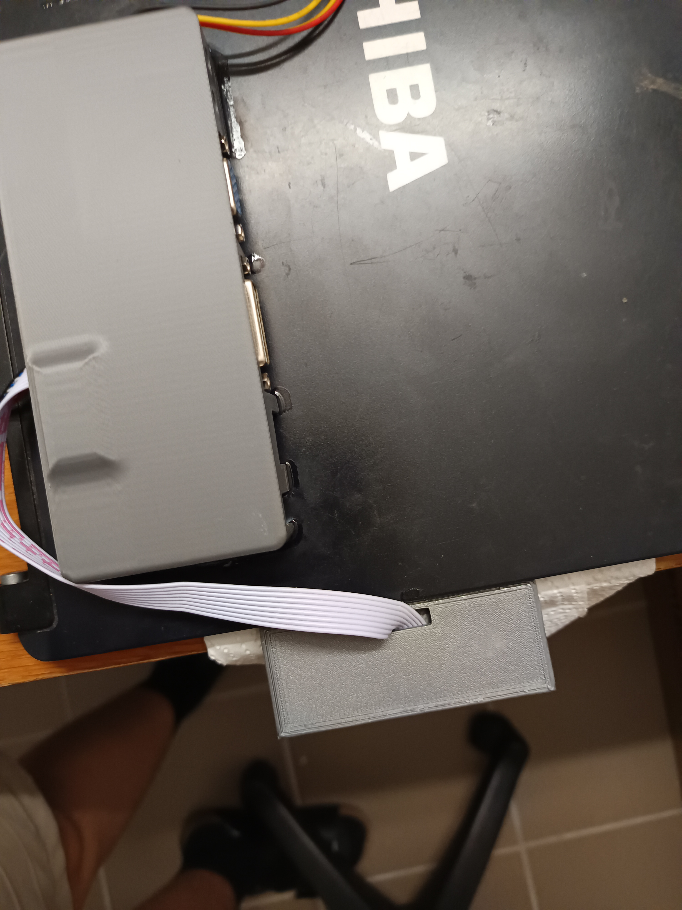

## Step 4: Printing the Stand of your monitor:

Adjust the monitor stand to your monitor, for this, you just need to adjust the thickniss of the notch (the big hole in the stand) to your monitor. Then print it and place it like this under your monitor:

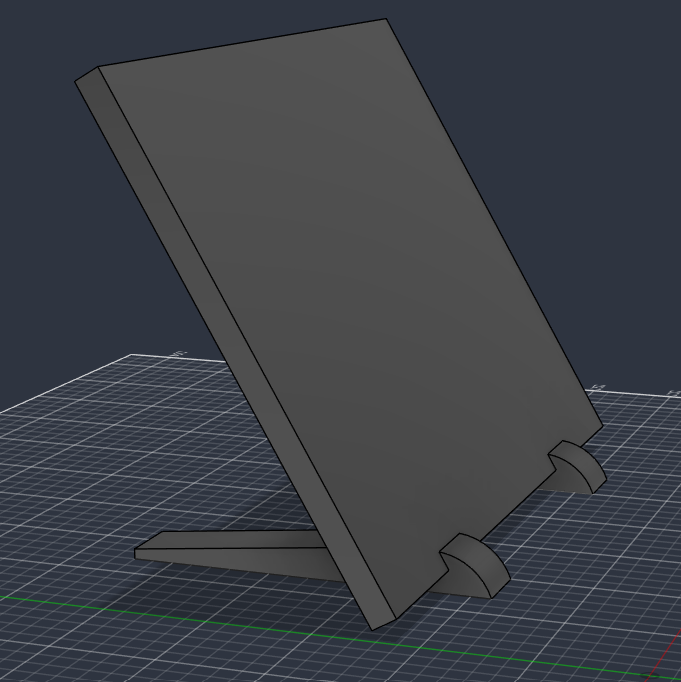

# BILL OF MATIRIALS:
- LP154WX4 (TL) (E1) aka. an old lcd screen out of an Labtop
- compatible controllers for your lcd screen (like this, sadly I havn't found the one, which I have, so you still need to adjust the enclosure)

Link: https://de.aliexpress.com/item/1005005975067411.html?spm=a2g0o.productlist.main.3.1b38jH34jH34LG&algo_pvid=eebdf741-7301-4065-a794-0221625f0a98&algo_exp_id=eebdf741-7301-4065-a794-0221625f0a98-2&pdp_ext_f=%7B%22order%22%3A%224%22%2C%22eval%22%3A%221%22%2C%22fromPage%22%3A%22search%22%7D&pdp_npi=6%40dis%21EUR%2123.55%2117.19%21%21%2126.30%2119.20%21%40210393bd17845639824468742e109a%2112000035129470428%21sea%21DE%210%21ABX%211%210%21n_tag%3A-29910%3Bd%3A60591074%3Bm03_new_user%3A-29895&curPageLogUid=Ph9pGr8QCu85&utparam-url=scene%3Asearch%7Cquery_from%3A%7Cx_object_id%3A1005005975067411%7C_p_origin_prod%3A

- being able to 3D-print your enclosure or being able to do a diffrent enclosure
- A powersource for the controller (for the controller linked above it is: 12V DC 4a )

Link: https://de.aliexpress.com/item/1005004497000966.html?spm=a2g0o.productlist.main.1.68c4vQxjvQxjCh&algo_pvid=6e319123-1a26-48f0-ad29-1b14fa4aabb3&algo_exp_id=6e319123-1a26-48f0-ad29-1b14fa4aabb3-0&pdp_ext_f=%7B%22order%22%3A%221277%22%2C%22eval%22%3A%221%22%2C%22fromPage%22%3A%22search%22%7D&pdp_npi=6%40dis%21EUR%213.35%213.35%21%21%213.74%213.74%21%400b0fe08917845642879394556e0ee0%2112000029365239086%21sea%21DE%210%21ABX%211%210%21n_tag%3A-29910%3Bd%3A60591074%3Bm03_new_user%3A-29895&curPageLogUid=vSurv6SGYXkA&utparam-url=scene%3Asearch%7Cquery_from%3A%7Cx_object_id%3A1005004497000966%7C_p_origin_prod%3A